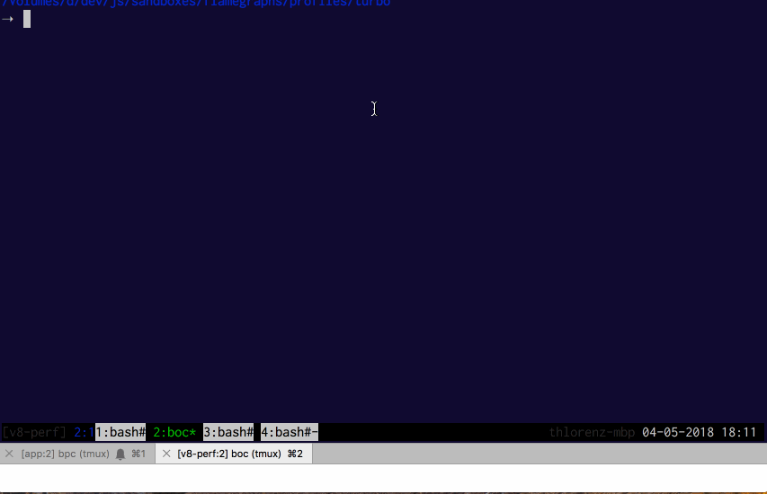

# Turbolizer

Turbolizer tool derived from the one included with `v8/tools`.



## Installation

```
npm install -g turbolizer
```

## Usage

Run your app with the `--trace-turbo` flag, i.e. `node --trace-turbo app.js` to produce `turbo-*.json` files.

Then just run `turbolizer` in the same directory and select which file (or all) you want to
load and the turbolizer application will open in the browser with it preloaded.

## Alternatives

If you don't want to install anything, as an alternative can then either load them one by one
via the hosted browser version of this repo at [thlorenz.github.io/turbolizer](https://thlorenz.github.io/turbolizer).

* * *

_Original Readme from the [v8 repository](https://github.com/v8/v8)_

Turbolizer
==========

Turbolizer is a HTML-based tool that visualizes optimized code along the various
phases of Turbofan's optimization pipeline, allowing easy navigation between
source code, Turbofan IR graphs, scheduled IR nodes and generated assembly code.

Turbolizer consumes .json files that are generated per-function by d8 by passing
the '--trace-turbo' command-line flag.

Host the turbolizer locally by starting a web server that serves the contents of
the turbolizer directory, e.g.:

    cd src/tools/turbolizer
    python -m SimpleHTTPServer 8000

Optionally, profiling data generated by the perf tools in linux can be merged
with the .json files using the turbolizer-perf.py file included. The following
command is an example of using the perf script:

    perf script -i perf.data.jitted -s turbolizer-perf.py turbo-main.json

The output of the above command is a json object that can be piped to a file
which, when uploaded to turbolizer, will display the event counts from perf next
to each instruction in the disassembly. Further detail can be found in the
bottom of this document under "Using Perf with Turbo."

Using the python interface in perf script requires python-dev to be installed
and perf be recompiled with python support enabled. Once recompiled, the
variable PERF_EXEC_PATH must be set to the location of the recompiled perf
binaries.

Graph visualization and manipulation based on Mike Bostock's sample code for an
interactive tool for creating directed graphs. Original source is at
https://github.com/metacademy/directed-graph-creator and released under the
MIT/X license.

Icons derived from the "White Olive Collection" created by Breezi released under
the Creative Commons BY license.

Using Perf with Turbo
---------------------

In order to generate perf data that matches exactly with the turbofan trace, you
must use either a debug build of v8 or a release build with the flag
'disassembler=on'. This flag ensures that the '--trace-turbo' will output the
necessary disassembly for linking with the perf profile.

The basic example of generating the required data is as follows:

    perf record -k mono /path/to/d8 --trace-turbo --perf-prof main.js
    perf inject -j -i perf.data -o perf.data.jitted
    perf script -i perf.data.jitted -s turbolizer-perf.py turbo-main.json

These commands combined will run and profile d8, merge the output into a single
'perf.data.jitted' file, then take the event data from that and link them to the
disassembly in the 'turbo-main.json'. Note that, as above, the output of the
script command must be piped to a file for uploading to turbolizer.

There are many options that can be added to the first command, for example '-e'
can be used to specify the counting of specific events (default: cycles), as
well as '--cpu' to specify which CPU to sample.
